# Hello-Flask Project Report
**Date:** January 20, 2026

---

## Project Overview
This is a simple Flask web application project that demonstrates a basic HTTP server setup with a single route. The project provides a foundation for building web applications using the Flask framework.

---

## Project Structure
```
Hello-Flask/
├── app.py                  # Main Flask application
├── requirements.txt        # Project dependencies
├── __pycache__/           # Python cache directory (auto-generated)
└── PROJECT_REPORT.md      # This file
```

---

## Files Created & Description

### 1. **app.py**
**Purpose:** Main application file containing the Flask server setup and route handlers.

**Key Features:**
- Flask application initialization
- Single GET route (`/`) that returns "Hello, Git!"
- Debug mode enabled for development

**Code Structure:**
```python
from flask import Flask

app = Flask(__name__)

@app.route('/')
def hello():
    return 'Hello, Git!'

if __name__ == '__main__':
    app.run(debug=True)
```

**How It Works:**
1. Imports the Flask class from the flask module
2. Creates a Flask application instance
3. Defines a route handler for the root path (`/`)
4. The `hello()` function returns a simple greeting message
5. When executed directly, the app runs on the default Flask server (localhost:5000) with debug mode enabled

---

### 2. **requirements.txt**
**Purpose:** Specifies all Python package dependencies for the project.

**Contents:**
```
flask
```

**How to Use:**
To install all project dependencies, run:
```bash
pip install -r requirements.txt
```

This will install Flask and any dependencies it requires.

---

## Setup & Execution Steps

### Step 1: Navigate to Project Directory
```bash
cd /Users/ludwigsevenheim/Developer/Hello-Flask
```

### Step 2: Create a Virtual Environment (Recommended)
```bash
python3 -m venv venv
```

### Step 3: Activate Virtual Environment
```bash
source venv/bin/activate
```

### Step 4: Install Dependencies
```bash
pip install -r requirements.txt
```

### Step 5: Run the Application
```bash
python app.py
```

**Expected Output:**
```
 * Serving Flask app 'app'
 * Debug mode: on
 * Running on http://127.0.0.1:5000
```

### Step 6: Access the Application
Open your web browser and navigate to:
```
http://localhost:5000/
```

You should see the message: **"Hello, Git!"**

---

## Technology Stack
- **Framework:** Flask (Python web framework)
- **Language:** Python 3
- **Server:** Flask development server
- **Configuration:** Debug mode enabled for development

---

## Development Notes

### Current Capabilities
- ✓ Basic HTTP GET endpoint
- ✓ Flask server setup
- ✓ Debug mode for development

### Future Enhancements (Optional)
- Add more routes for different endpoints
- Implement HTML templates using Jinja2
- Add static files (CSS, JavaScript, images)
- Implement database integration
- Add error handling and logging
- Deploy to production server

---

## Git Version Control

### What is Git?
Git is a distributed version control system that tracks changes to your code over time. It allows you to:
- Save snapshots of your project at different points in time
- Collaborate with other developers
- Revert to previous versions if needed
- Branch off to work on features independently
- Maintain a complete history of all changes

### Key Git Concepts

#### Working Directory
Your local folder where you edit files. This is where you make changes to your code.

#### Staging Area
A temporary holding area where you select which changes to include in your next commit. Not all modified files need to be staged.

#### Repository (Local)
Your local Git database that stores all committed changes and history.

#### Remote Repository
A copy of your repository on a server (like GitHub, GitLab, or Bitbucket) that allows collaboration and backup.

### Essential Git Commands for This Project

#### Initialize Git (if not already done)
```bash
git init
```
Creates a new `.git` directory in your project folder.

#### Check Git Status
```bash
git status
```
Shows which files have been modified, staged, or are untracked.

#### Stage Changes (git add)
```bash
git add app.py
# or add all changes
git add .
```
Moves files from the Working Directory to the Staging Area. This tells Git which changes you want to include in your next commit.

#### Commit Changes (git commit)
```bash
git commit -m "Initial Flask app setup"
```
Takes everything in the Staging Area and creates a permanent snapshot with a descriptive message. This creates a point in history you can return to.

#### Push to Remote (git push)
```bash
git push origin main
```
Uploads your local commits to the remote repository (e.g., GitHub). This backs up your code and shares it with collaborators.

#### View Commit History
```bash
git log
```
Displays all previous commits with timestamps and messages.

### Git Workflow Diagram

```mermaid
graph LR
    WD["📁 Working Directory<br/>(Your Local Files)"] -->|git add| SA["📋 Staging Area<br/>(Prepare for Commit)"]
    SA -->|git commit| LR["💾 Local Repository<br/>(History Saved)"]
    LR -->|git push| RR["☁️ Remote Repository<br/>(GitHub/GitLab)"]
    
    RR -->|git pull| LR
    LR -->|git checkout| WD
    
    style WD fill:#FFE5E5
    style SA fill:#FFF4E5
    style LR fill:#E5F5FF
    style RR fill:#E5FFE5
```



### Step-by-Step Git Workflow Example

**Step 1: Make Changes**
Edit your files in the Working Directory (e.g., modify `app.py`)

**Step 2: Stage Changes**
```bash
git add app.py
```
This moves your changes to the Staging Area.

**Step 3: Commit Changes**
```bash
git commit -m "Add initial Flask route"
```
Creates a snapshot with a descriptive message.

**Step 4: Push to Remote**
```bash
git push origin main
```
Uploads your commits to the remote repository.

---

## Flask HTTP Request/Response Cycle

### How Requests Work in Your Application

When you visit `http://localhost:5000/` in your browser, here's what happens:

```mermaid
sequenceDiagram
    participant Client as 🌐 Web Browser<br/>(Client)
    participant Server as 🖥️ Flask Server<br/>(Your App)
    participant Route as 📍 Route Handler<br/>(@app.route)
    
    Client->>Server: 1. HTTP GET Request<br/>GET /
    activate Server
    Server->>Route: 2. Match route to handler
    activate Route
    Route->>Route: 3. Execute hello() function
    Route-->>Server: 4. Return 'Hello, Git!'
    deactivate Route
    Server-->>Client: 5. HTTP Response<br/>Status 200 OK<br/>Body: 'Hello, Git!'
    deactivate Server
    Client->>Client: 6. Display response<br/>in browser
```



### Request Flow Breakdown

**1. Client Request**
- Browser sends an HTTP GET request to `http://localhost:5000/`
- Includes request method (GET), path (/), headers, etc.

**2. Server Receives**
- Flask server listens on port 5000
- Receives the incoming HTTP request

**3. Route Matching**
- Flask checks if the request path matches any defined routes
- Finds the `@app.route('/')` decorator

**4. Handler Execution**
- The `hello()` function is called
- Returns the string `'Hello, Git!'`

**5. Response Generation**
- Flask creates an HTTP response with:
  - Status Code: 200 (OK)
  - Body: The returned string
  - Headers: Content-Type, etc.

**6. Client Display**
- Browser receives the response
- Displays `'Hello, Git!'` on the page

### Application Flow Diagram

```mermaid
graph TD
    A["👤 User<br/>Visits localhost:5000"] --> B["📡 HTTP GET Request"]
    B --> C["🖥️ Flask App Started<br/>(app.run)"]
    C --> D["🔀 Route Dispatcher<br/>(@app.route)"]
    D --> E{"Does route<br/>match?"}
    E -->|Yes: /| F["⚡ Execute hello()<br/>function"]
    E -->|No| G["❌ 404 Not Found"]
    F --> H["📤 Return Response<br/>Status 200<br/>Body: 'Hello, Git!'"]
    G --> I["📤 Return Error<br/>Status 404"]
    H --> J["🌐 Browser<br/>Displays Result"]
    I --> J
    
    style A fill:#FFE5E5
    style J fill:#E5FFE5
    style F fill:#E5F5FF
    style E fill:#FFF4E5
```



### URL Structure Explained

For your Flask app at `http://localhost:5000/`:

```
http://localhost:5000/
│      │          │    │
│      │          │    └── Path (Route)
│      │          └──────── Port (5000 is default Flask)
│      └───────────────────── Host/Domain (localhost = your computer)
└──────────────────────────── Protocol (HTTP)
```

### Common HTTP Methods

| Method | Purpose | Example |
|--------|---------|---------|
| **GET** | Retrieve data | Viewing a webpage |
| **POST** | Submit data | Submitting a form |
| **PUT** | Update data | Updating a user profile |
| **DELETE** | Remove data | Deleting a post |

Your current app only handles **GET** requests to the root path (`/`).

### HTTP Status Codes

| Code | Meaning | Example |
|------|---------|---------|
| **200** | OK (Success) | Request handled successfully |
| **404** | Not Found | Route doesn't exist |
| **500** | Server Error | Code has an error |

---

### Git Push/Pull Request Flow Diagram

When you push or pull changes, here's how Git communicates with the remote repository:

```mermaid
sequenceDiagram
    participant Local as 💻 Local Repository<br/>(Your Computer)
    participant Network as 🌐 Network
    participant Remote as ☁️ Remote Repository<br/>(GitHub)
    
    Note over Local,Remote: PUSH: Uploading Changes
    Local->>Network: 1. Create pack file<br/>(compressed commits)
    Network->>Remote: 2. Send HTTP/SSH request<br/>with authentication
    activate Remote
    Remote->>Remote: 3. Verify credentials<br/>& permissions
    Remote->>Remote: 4. Update refs<br/>(branch pointers)
    Remote->>Remote: 5. Store objects<br/>(commits, trees, blobs)
    Remote-->>Network: 6. Send confirmation
    deactivate Remote
    Network-->>Local: 7. Receive success<br/>response
    
    Note over Local,Remote: PULL: Downloading Changes
    Local->>Network: 8. Send fetch request<br/>with authentication
    Network->>Remote: 9. Request latest commits
    activate Remote
    Remote->>Remote: 10. Check branch refs
    Remote-->>Network: 11. Send pack file<br/>(compressed objects)
    deactivate Remote
    Network-->>Local: 12. Receive objects
    Local->>Local: 13. Merge changes<br/>into local branch
    Local->>Local: 14. Update working<br/>directory
```



### Push vs Pull Explained

#### Git Push (Upload to Remote)
```bash
git push origin main
```

**Direction:** Local → Remote  
**Purpose:** Upload your local commits to the remote repository  
**Steps:**
1. Git packages your new commits
2. Connects to the remote server (GitHub)
3. Authenticates with your credentials
4. Transfers the commits
5. Updates the remote branch pointer

#### Git Pull (Download from Remote)
```bash
git pull origin main
```

**Direction:** Remote → Local  
**Purpose:** Download commits from remote and merge them into your local branch  
**Steps:**
1. Fetches commits from remote repository
2. Downloads the objects (commits, trees, blobs)
3. Merges the remote changes into your local branch
4. Updates your working directory

### Synchronization Workflow Diagram

```mermaid
graph LR
    subgraph Local ["💻 Your Local Machine"]
        WD["📁 Working<br/>Directory"]
        SA["📋 Staging<br/>Area"]
        LR["💾 Local<br/>Repository"]
    end
    
    subgraph Network ["🌐 Network Connection"]
        PUSH["📤 PUSH<br/>(Upload)"]
        PULL["📥 PULL<br/>(Download)"]
    end
    
    subgraph Remote ["☁️ GitHub/Remote"]
        RR["🖥️ Remote<br/>Repository"]
    end
    
    WD -->|git add| SA
    SA -->|git commit| LR
    LR -->|git push| PUSH
    PUSH -->|HTTP/SSH| RR
    RR -->|HTTP/SSH| PULL
    PULL -->|git pull| LR
    LR -->|git checkout| WD
    
    style Local fill:#FFE5E5
    style Network fill:#FFF4E5
    style Remote fill:#E5FFE5
```



### Setting Up Remote Repository (GitHub)

1. Create a new repository on GitHub
2. Link your local repository to remote:
```bash
git remote add origin https://github.com/yourusername/Hello-Flask.git
```

3. Push your code:
```bash
git branch -M main
git push -u origin main
```

### Helpful Git Tips

- **Commit Frequently:** Make small, focused commits with clear messages
- **Meaningful Messages:** Use descriptive commit messages like "Add user authentication" instead of "Fix stuff"
- **Check Status Often:** Use `git status` to see what will be committed
- **Pull Before Push:** Always `git pull` before `git push` to avoid conflicts
- **Create Branches:** Use `git checkout -b feature-name` for new features

---

## Troubleshooting

### Port Already in Use
If port 5000 is already in use, modify the app.py file:
```python
app.run(debug=True, port=5001)
```

### Module Not Found Error
Ensure Flask is installed:
```bash
pip install flask
```

### Permission Denied
Make the script executable:
```bash
chmod +x app.py
```

### Git Push Fails
Ensure you have:
1. Added your remote: `git remote add origin <url>`
2. Committed your changes: `git commit -m "message"`
3. Pulled latest changes: `git pull origin main`

---

## Summary
This Hello-Flask project provides a minimal but functional Flask web application. Follow the setup steps above to get the server running and accessible via your web browser. Use Git to track your changes, maintain version history, and collaborate with others. The project can be expanded with additional routes, templates, and features as needed.
